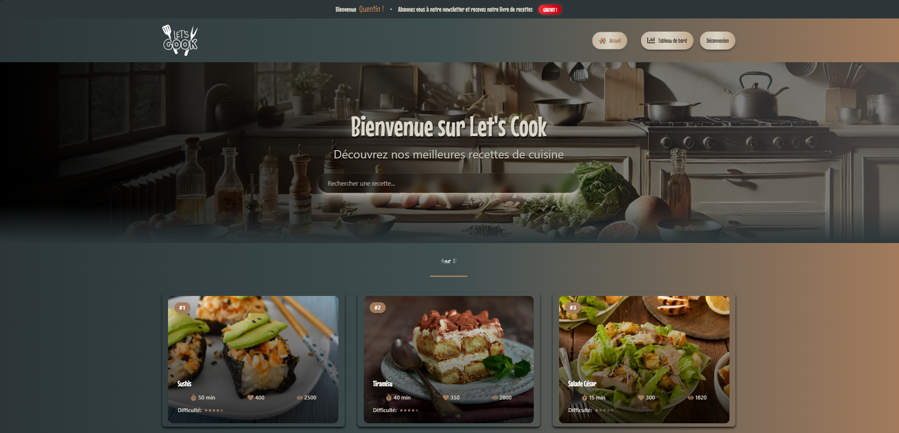
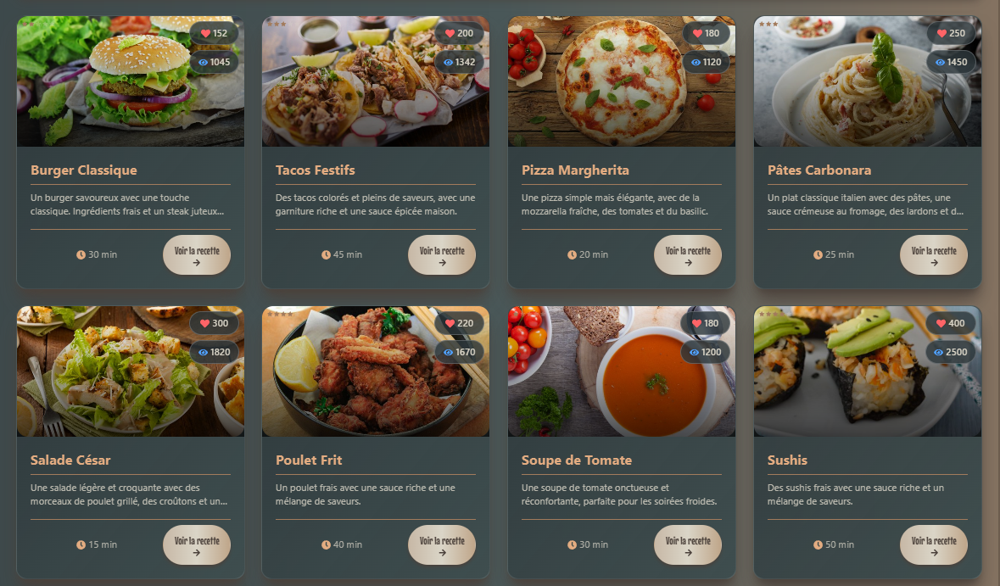
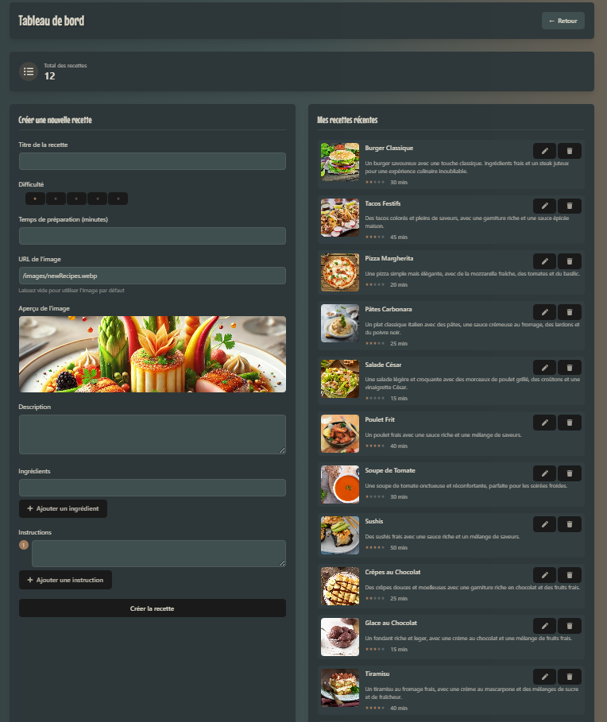
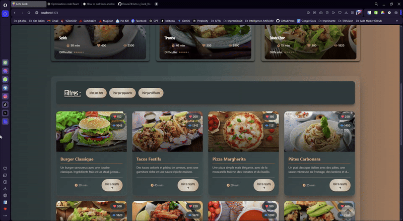
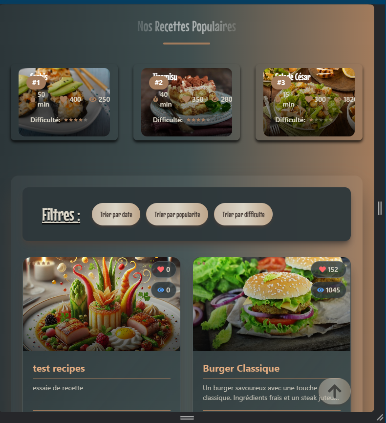
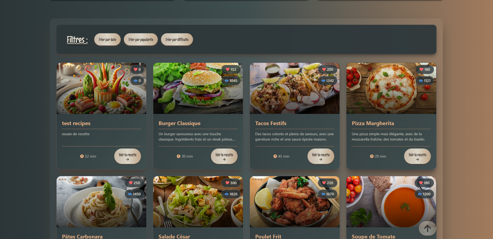

# 🍳 Let's Cook V5 - Votre Carnet de Recettes Numérique

## 🎥 Démonstration du Site


---

## 💡 C'est Quoi Let's Cook ?

Let's Cook est votre assistant cuisine personnel ! C'est comme un grand livre de recettes numérique où vous pouvez :

- 📱 Consulter vos recettes préférées sur téléphone, tablette ou ordinateur
- 🔍 Trouver facilement une recette avec notre recherche intelligente
- ⭐ Noter vos recettes et leur niveau de difficulté
- 📝 Ajouter vos propres recettes et les partager
- 👥 Créer votre profil de cuisinier

## 🎯 Pour Qui C'est Fait ?

- 👨‍🍳 Les passionnés de cuisine qui veulent organiser leurs recettes
- 🏠 Les familles qui cherchent des idées de repas
- 🌱 Les débutants qui veulent apprendre à cuisiner
- 👥 Les amis qui veulent partager leurs recettes

## 🚀 Comment Ça Marche ?

### 1. La Page d'Accueil

Quand vous arrivez sur le site, vous voyez :

- Une barre de recherche pour trouver vos recettes
- Les recettes populaires du moment
- Des suggestions selon la saison
- Un menu simple pour naviguer
  <!-- saut de ligne -->
  <br />
    

<br />

### 2. Les Recettes

Chaque recette montre :

- Une belle photo du plat
- Le temps de préparation
- Le niveau de difficulté avec des étoiles
- La liste des ingrédients
- Les étapes de préparation
- Des conseils et astuces

  <br />
  

<br />

### 3. Votre Espace Personnel

Vous pouvez :

- Sauvegarder vos recettes préférées (A venir)
- Créer vos propres recettes
- Noter les recettes que vous avez essayées (A venir)
- Suivre d'autres cuisiniers (A venir)

  <br />
  

<br />

# 🎨 Ce Qui Rend Let's Cook Spécial

### 1. Une Recherche Super Intelligente

```jsx
// Notre système comprend même si vous faites des fautes !
// Par exemple : "pate" trouve aussi "pâtes" et "pâté"
const rechercheIntelligente = recherche => {
  // On simplifie le texte (enlève les accents, majuscules...)
  const texteSimple = simplifierTexte(recherche)

  // On cherche dans toutes les recettes
  return recettes.filter(recette => {
    // On vérifie le titre, les ingrédients, et les tags
    return (
      recette.titre.includes(texteSimple) ||
      recette.ingredients.some(i => i.includes(texteSimple))
    )
  })
}
```


### 2. Des Cartes de Recettes Animées

Quand vous passez la souris sur une recette :

- L'image s'agrandit doucement
- Les informations apparaissent en fondu
- Un joli effet d'ombre se crée

```jsx
// Notre carte de recette interactive
const CarteRecette = ({ recette }) => {
  return (
    <div className="carte-recette-animee">
      
      <div className="infos-recette">
        <h3>{recette.nom}</h3>
        <p>⏰ {recette.temps} minutes</p>
        <p>👨‍🍳 {recette.difficulte}</p>
      </div>
    </div>
  )
}
```

  <br />



<br />

### 3. Un Tableau de Bord Pratique

```jsx
// Votre espace personnel avec vos statistiques
const MonTableauBord = () => {
  return (
    <div className="tableau-de-bord">
      <div className="mes-stats">
        <h2>Mes Recettes</h2>
        <p>Recettes créées : {stats.creees}</p>
        <p>Recettes favorites : {stats.favorites}</p>
        <p>Recettes essayées : {stats.essayees}</p>
      </div>

      <div className="suggestions">
        <h2>Suggestions du Jour</h2>
        {/* Liste des recettes suggérées */}
      </div>
    </div>
  )
}
```

  <br />
https://user-images.githubusercontent.com/Eloura74/LetsCookV3/main/lets-cook-v5/public/readme_media/DashboardVideo.gif


<br />

## 🛠️ Les Outils Qu'On A Utilisé

### Pour les Curieux qui Veulent Comprendre Comment C'est Fait

#### 1. Le Cerveau du Site (React)

C'est comme les Lego® : on assemble des petites pièces (composants) pour créer quelque chose de grand !

```jsx
// Un exemple simple : le bouton "J'aime"
const BoutonJaime = () => {
  const [aime, setAime] = useState(false)

  return <button onClick={() => setAime(!aime)}>{aime ? '❤️' : '🤍'}</button>
}
```

#### 2. Le Style du Site (Tailwind)

On utilise des mots simples pour rendre le site joli :

```jsx
// Une carte de recette jolie
<div
  className="
  arrondi        {/* Coins arrondis */}
  ombre          {/* Petite ombre */}
  grandir-hover  {/* Grandit au survol */}
"
>
  {/* Le contenu de la carte */}
</div>
```

#### 3. Les Animations (Framer Motion)

Pour que tout bouge joliment :

```jsx
// Animation douce quand une recette apparaît
const animationRecette = {
  debut: { invisible: true },
  fin: {
    visible: true,
    transition: { doux: true },
  },
}
```

## 📱 Comment On S'Adapte à Votre Écran

### Sur Téléphone (360x800)

- Menu compact
- Une recette par ligne
- Boutons plus grands pour le toucher

  <br />
  

<br />

### Sur Tablette (768x800)

- Deux recettes par ligne
- Menu semi-déplié
- Navigation tactile optimisée

  <br />
  

<br />

### Sur Ordinateur (1920x1080)

- Affichage complet
- Jusqu'à 4 recettes par ligne
- Utilisation de la souris optimisée

  <br />
  

<br />

## 🎯 Nos Petits Plus A Venir:

### 1. Mode Sombre

Pour cuisiner même la nuit sans vous éblouir !

```jsx
// Changement automatique selon l'heure
const modeSombre = () => {
  const heure = new Date().getHours()
  return heure < 6 || heure > 20
}
```

### 2. Mode Hors-Ligne

Vos recettes préférées même sans internet !

```jsx
// On garde vos recettes en mémoire
const sauvegarderHorsLigne = recette => {
  localStorage.setItem('recettes-favorites', JSON.stringify(recette))
}
```

### 3. Partage Facile

Partagez vos recettes sur WhatsApp, Facebook, ou par email !

```jsx
// Bouton de partage simple
const PartagerRecette = ({ recette }) => {
  return (
    <div className="boutons-partage">
      <button>📱 WhatsApp</button>
      <button>📘 Facebook</button>
      <button>📧 Email</button>
    </div>
  )
}
```

## 🌟 Comment Utiliser Let's Cook ?

### 1. Première Visite

1. Créez votre compte (c'est gratuit !)
2. Explorez les recettes populaires
3. Sauvegardez vos recettes préférées

### 2. Ajoutez Vos Recettes

1. Cliquez sur "Nouvelle Recette"
2. Ajoutez une belle photo
3. Écrivez les étapes
4. Partagez avec la communauté

### 3. Utilisez la Recherche

1. Tapez un ingrédient ou un nom
2. Utilisez les filtres (temps, difficulté)
3. Trouvez la recette parfaite !

## 🤝 Rejoignez Notre Communauté !

- 👨‍🍳 Partagez vos créations
- 💬 Échangez des conseils
- 🌟 Notez les recettes
- 🤝 Aidez les débutants

## 📞 Besoin d'Aide ?

- 📧 Email : aide@letscook.fr
- 💬 Chat en direct sur le site
- 📱 Application mobile disponible

---

⭐ Vous aimez Let's Cook ? Donnez-nous une étoile sur GitHub !
Créé avec ❤️ par Eloura74
