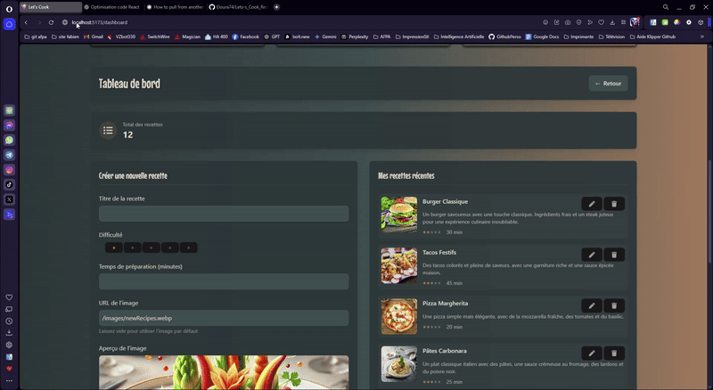

# 🍳 Let's Cook V5 - Votre Carnet de Recettes Numérique

## 🎥 Démonstration du Site

<div align="center">
  
</div>

---

## 💡 C'est Quoi Let's Cook ?

Let's Cook est votre assistant cuisine personnel ! C'est comme un grand livre de recettes numérique où vous pouvez :

- 📱 Consulter vos recettes préférées sur téléphone, tablette ou ordinateur
- 🔍 Trouver facilement une recette avec notre recherche intelligente
- ⭐ Noter vos recettes et leur niveau de difficulté
- 📝 Ajouter vos propres recettes et les partager
- 👥 Créer votre profil de cuisinier

## 🎯 Pour Qui C'est Fait ?

- 👨‍🍳 Les passionnés de cuisine qui veulent organiser leurs recettes
- 🏠 Les familles qui cherchent des idées de repas
- 🌱 Les débutants qui veulent apprendre à cuisiner
- 👥 Les amis qui veulent partager leurs recettes

## 🚀 Comment Ça Marche ?

### 1. La Page d'Accueil

Quand vous arrivez sur le site, vous voyez :

- Une barre de recherche pour trouver vos recettes
- Les recettes populaires du moment
- Des suggestions selon la saison
- Un menu simple pour naviguer
  <!-- saut de ligne -->
  <br />
    

<br />

### 2. Les Recettes

Chaque recette montre :

- Une belle photo du plat
- Le temps de préparation
- Le niveau de difficulté avec des étoiles
- La liste des ingrédients
- Les étapes de préparation
- Des conseils et astuces

  <br />
  

<br />

### 3. Votre Espace Personnel

Vous pouvez :

- Sauvegarder vos recettes préférées (A venir)
- Créer vos propres recettes
- Noter les recettes que vous avez essayées (A venir)
- Suivre d'autres cuisiniers (A venir)

  <br />
  

<br />

# 🎨 Ce Qui Rend Let's Cook Spécial

### 1. Une Recherche Super Intelligente

```jsx
// Notre système comprend même si vous faites des fautes !
// Par exemple : "pate" trouve aussi "pâtes" et "pâté"
const rechercheIntelligente = recherche => {
  // On simplifie le texte (enlève les accents, majuscules...)
  const texteSimple = simplifierTexte(recherche)

  // On cherche dans toutes les recettes
  return recettes.filter(recette => {
    // On vérifie le titre, les ingrédients, et les tags
    return (
      recette.titre.includes(texteSimple) ||
      recette.ingredients.some(i => i.includes(texteSimple))
    )
  })
}
```


### 2. Des Cartes de Recettes Animées

Quand vous passez la souris sur une recette :

- L'image s'agrandit doucement
- Les informations apparaissent en fondu
- Un joli effet d'ombre se crée

```jsx
// Notre carte de recette interactive
const CarteRecette = ({ recette }) => {
  return (
    <div className="carte-recette-animee">
      
      <div className="infos-recette">
        <h3>{recette.nom}</h3>
        <p>⏰ {recette.temps} minutes</p>
        <p>👨‍🍳 {recette.difficulte}</p>
      </div>
    </div>
  )
}
```

  <br />

<div align="center">
  
</div>

<br />

### 3. Un Tableau de Bord Pratique

```jsx
// Votre espace personnel avec vos statistiques
const MonTableauBord = () => {
  return (
    <div className="tableau-de-bord">
      <div className="mes-stats">
        <h2>Mes Recettes</h2>
        <p>Recettes créées : {stats.creees}</p>
        <p>Recettes favorites : {stats.favorites}</p>
        <p>Recettes essayées : {stats.essayees}</p>
      </div>

      <div className="suggestions">
        <h2>Suggestions du Jour</h2>
        {/* Liste des recettes suggérées */}
      </div>
    </div>
  )
}
```

  <br />

<div align="center">
  
</div>


<br />

## 🔍 Système de Stockage et Recherche

### Architecture et Implémentation

Let's Cook utilise une architecture moderne basée sur le localStorage pour gérer efficacement vos recettes. Voici les détails techniques :

#### 1. Gestion de l'État avec Context API et localStorage

```javascript
// RecipesContext.jsx - Gestion centralisée des recettes avec stockage local
const RecipesContext = createContext() // Création du contexte pour partager les données

export const RecipesProvider = ({ children }) => {
  // État principal pour stocker toutes les recettes
  const [recettes, setRecettes] = useState([])
  
  // Effet qui s'exécute au montage du composant pour charger les recettes depuis le localStorage
  useEffect(() => {
    // Récupération des recettes depuis le stockage local
    const recettesSauvegardees = localStorage.getItem('recettes')
    
    // Conversion des données JSON en objet JavaScript
    // Si aucune recette n'existe, on initialise un tableau vide
    const recettesLocales = recettesSauvegardees 
      ? JSON.parse(recettesSauvegardees) 
      : []
    
    // Transformation des données pour assurer un format cohérent
    const recettesFormatees = recettesLocales.map(recette => ({
      ...recette,                                    // On garde toutes les propriétés existantes
      id: recette.id.toString(),                    // Conversion de l'ID en chaîne
      difficulte: parseInt(recette.difficulte) || 0,// Conversion en nombre avec valeur par défaut
      date: recette.date || new Date().toISOString()// Ajout d'une date si absente
    }))

    // Mise à jour de l'état avec les recettes formatées
    setRecettes(recettesFormatees)
  }, []) // Le tableau vide signifie que l'effet ne s'exécute qu'une fois

  // Fourniture des données et fonctions à tous les composants enfants
  return (
    <RecipesContext.Provider value={{ recettes, setRecettes }}>
      {children}
    </RecipesContext.Provider>
  )
}
```

**Avantages de cette approche :**
- 🔄 Source unique de vérité : Toutes les données sont centralisées
- 📦 Persistance des données : Les recettes sont sauvegardées localement
- 🚀 Performance optimisée : Accès rapide aux données sans requêtes serveur
- 💾 Hors ligne : L'application fonctionne même sans connexion internet

#### 2. Système de Recherche Intelligent

```javascript
// BarreRecherche.jsx - Composant de recherche avancée
const BarreRecherche = () => {
  // État local pour stocker le terme de recherche
  const [termeRecherche, setTermeRecherche] = useState('')
  
  // Récupération des recettes depuis le contexte
  const { recettes } = useRecipes()
  
  // Création d'une version "debounced" de la recherche
  // Attend 300ms après la dernière frappe avant de lancer la recherche
  const rechercheDifferee = useDebounce(termeRecherche, 300)
  
  // Fonction de normalisation du texte pour la recherche
  const rechercherDansTexte = (texte, recherche) => {
    if (!texte) return false // Protection contre les valeurs null/undefined
    
    const normaliser = texte => texte
      .toLowerCase()                               // Conversion en minuscules
      .normalize('NFD')                           // Normalisation Unicode
      .replace(/[\u0300-\u036f]/g, '')           // Suppression des accents
      .trim()                                     // Suppression des espaces inutiles
    
    // Vérification si le texte normalisé contient le terme de recherche
    return normaliser(texte).includes(normaliser(recherche))
  }
  
  // Filtrage des recettes avec mémorisation des résultats
  const recettesFiltrees = useMemo(() => 
    recettes
      .filter(recette => (
        // Recherche dans le titre
        rechercherDansTexte(recette.titre, rechercheDifferee) ||
        // Recherche dans les ingrédients
        recette.ingredients.some(ing => 
          rechercherDansTexte(ing, rechercheDifferee)
        ) ||
        // Recherche dans la catégorie
        rechercherDansTexte(recette.categorie, rechercheDifferee)
      ))
      .slice(0, 5), // Limite à 5 résultats pour la performance
    [recettes, rechercheDifferee] // Recalcul uniquement si ces valeurs changent
  )

  return (
    <div className="conteneur-recherche">
      <input
        type="text"
        value={termeRecherche}
        onChange={e => setTermeRecherche(e.target.value)}
        placeholder="Rechercher une recette..."
      />
      {/* Affichage des résultats filtrés */}
      <ResultatsRecherche recettes={recettesFiltrees} />
    </div>
  )
}
```

**Optimisations clés :**
- ⚡ Différé : Évite les recherches inutiles pendant la frappe
- 🧠 Normalisation : Gestion intelligente des accents et de la casse
- 🎯 Mise en cache : useMemo pour éviter les calculs répétés
- 📊 Multi-critères : Recherche dans titre, ingrédients et catégories

#### 3. Gestion Efficace des Données

- **Context API** : Toutes les recettes sont chargées une seule fois au démarrage
- **Recherche Instantanée** : Les résultats apparaissent en temps réel pendant la frappe
- **Limite Intelligente** : Affichage des 5 meilleurs résultats pour une meilleure performance

```javascript
// Exemple de filtrage des recettes
const recettesFiltrees = recettes
  .filter(recette => {
    if (!termeRecherche.trim()) return false
    return rechercherDansTexte(recette.titre, termeRecherche)
  })
  .slice(0, 5) // Limite aux 5 premiers résultats
```

### Avantages de Notre Système

- 🚀 Recherche ultra-rapide (pas d'appels serveur)
- 📱 Fonctionne même hors connexion
- 🎯 Résultats pertinents et instantanés
- 🧠 Intelligent avec les fautes de frappe et les accents

## 🔄 Système de Filtrage Avancé

### Architecture et Performances

Notre système de filtrage utilise des techniques avancées pour garantir performance et flexibilité :

#### 1. Configuration Déclarative des Filtres

```javascript
// Filtres.jsx - Configuration modulaire des filtres
const configurationFiltres = {
  // Configuration du filtre par date
  date: {
    normal: {
      texte: 'Du plus récent',
      trier: recettes => [...recettes].sort((a, b) => {
        // Conversion sécurisée des dates avec gestion des erreurs
        const dateA = new Date(a.date || 0).getTime() // Valeur par défaut si date invalide
        const dateB = new Date(b.date || 0).getTime()
        return dateB - dateA // Tri décroissant (plus récent d'abord)
      })
    },
    inverse: {
      texte: 'Du plus ancien',
      trier: recettes => [...recettes].sort((a, b) => {
        const dateA = new Date(a.date || 0).getTime()
        const dateB = new Date(b.date || 0).getTime()
        return dateA - dateB // Tri croissant (plus ancien d'abord)
      })
    }
  },

  // Configuration du filtre par popularité
  popularite: {
    normal: {
      texte: 'Les plus populaires',
      trier: recettes => [...recettes].sort((a, b) => {
        // Conversion des likes en nombre avec valeur par défaut
        const likesA = parseInt(a.likes) || 0    // 0 si pas de likes ou invalide
        const likesB = parseInt(b.likes) || 0
        return likesB - likesA                   // Tri par nombre de likes décroissant
      })
    }
  }
}

// Gestion de l'état des filtres avec useReducer pour une meilleure organisation
const reducteurFiltres = (etat, action) => {
  switch (action.type) {
    case 'BASCULER_FILTRE':
      // Création d'un nouvel état avec tous les filtres désactivés
      const nouvelEtat = {
        date: { actif: false, inverse: false },
        popularite: { actif: false, inverse: false },
        difficulte: { actif: false, inverse: false }
      }
      
      // Si le filtre était déjà actif, on inverse son sens
      if (etat[action.payload].actif) {
        nouvelEtat[action.payload] = {
          actif: true,
          inverse: !etat[action.payload].inverse
        }
      } else {
        // Sinon on l'active simplement dans son sens normal
        nouvelEtat[action.payload] = {
          actif: true,
          inverse: false
        }
      }
      
      return nouvelEtat
    default:
      return etat
  }
}
```

#### 2. Interface Utilisateur Réactive

```javascript
// Composant de bouton de filtre avec gestion d'état et animations
const BoutonFiltre = ({ filtre, etat, onChange }) => {
  // Mémoisation des styles pour éviter les re-calculs inutiles
  const stylesButton = useMemo(() => 
    calculerStylesBouton(
      etat.actif,    // Style différent si le filtre est actif
      etat.inverse   // Style différent si le tri est inversé
    ),
    [etat.actif, etat.inverse]
  )
  
  return (
    <motion.button
      className={stylesButton}
      // Animations fluides avec Framer Motion
      whileHover={{ scale: 1.05 }}  // Légère augmentation de taille au survol
      whileTap={{ scale: 0.95 }}    // Légère réduction à l'appui
      onClick={() => onChange(filtre.nom)}
    >
      {/* Affichage dynamique du libellé selon l'état */}
      {filtre.getLibelle(etat)}
      {/* Icône qui tourne selon l'état du filtre */}
      <IconeFiltre 
        estActif={etat.actif}
        estInverse={etat.inverse}
      />
    </motion.button>
  )
}
```

#### 3. Optimisations de Performance

```javascript
// Hook personnalisé pour la gestion efficace des recettes filtrées
const useRecettesFiltrees = (recettes, filtreActif, etatFiltres) => {
  // Mémorisation des résultats pour éviter les calculs répétés
  return useMemo(() => {
    // Retour rapide si aucun filtre n'est actif
    if (!filtreActif) return recettes
    
    // Récupération de la configuration du filtre actif
    const configFiltre = getConfigurationFiltre(filtreActif)
    
    // Sélection de la fonction de tri selon l'état du filtre
    const fonctionTri = etatFiltres[filtreActif].inverse
      ? configFiltre.inverse.trier    // Fonction de tri inverse
      : configFiltre.normal.trier     // Fonction de tri normale
      
    // Application du tri et retour des résultats
    return fonctionTri(recettes)
  }, [
    recettes,     // Recalcul si les recettes changent
    filtreActif,  // Recalcul si le filtre actif change
    etatFiltres   // Recalcul si l'état des filtres change
  ])
}

// Exemple d'utilisation dans un composant
const ListeRecettes = () => {
  const { recettes } = useRecipes()
  const [filtreActif, setFiltreActif] = useState(null)
  const [etatFiltres, dispatch] = useReducer(reducteurFiltres, etatInitial)
  
  // Utilisation du hook personnalisé pour obtenir les recettes filtrées
  const recettesFiltrees = useRecettesFiltrees(
    recettes,
    filtreActif,
    etatFiltres
  )
  
  return (
    <div className="liste-recettes">
      {/* Affichage des boutons de filtre */}
      <BoutonsFiltres
        filtreActif={filtreActif}
        etatFiltres={etatFiltres}
        onChangementFiltre={gererChangementFiltre}
      />
      {/* Affichage des recettes filtrées */}
      <GrilleRecettes recettes={recettesFiltrees} />
    </div>
  )
}
```

**Points techniques importants :**
- 🔄 Immutabilité : Utilisation du spread operator pour éviter les mutations
- 🎯 Typage des actions : Actions typées pour le réducteur
- ⚡ Performance : Tri optimisé avec des comparaisons directes
- 🛡️ Robustesse : Gestion des cas d'erreur et valeurs manquantes

## 📱 Comment On S'Adapte à Votre Écran

### Sur Téléphone (360x800)

- Menu compact
- Une recette par ligne
- Boutons plus grands pour le toucher

  <br />
  

<br />

### Sur Tablette (768x800)

- Deux recettes par ligne
- Menu semi-déplié
- Navigation tactile optimisée

  <br />
  

<br />

### Sur Ordinateur (1920x1080)

- Affichage complet
- Jusqu'à 4 recettes par ligne
- Utilisation de la souris optimisée

  <br />
  

<br />

## 🎯 Nos Petits Plus A Venir:

### 1. Mode Sombre

Pour cuisiner même la nuit sans vous éblouir !

```jsx
// Changement automatique selon l'heure
const modeSombre = () => {
  const heure = new Date().getHours()
  return heure < 6 || heure > 20
}
```

### 2. Mode Hors-Ligne

Vos recettes préférées même sans internet !

```jsx
// On garde vos recettes en mémoire
const sauvegarderHorsLigne = recette => {
  localStorage.setItem('recettes-favorites', JSON.stringify(recette))
}
```

### 3. Partage Facile

Partagez vos recettes sur WhatsApp, Facebook, ou par email !

```jsx
// Bouton de partage simple
const PartagerRecette = ({ recette }) => {
  return (
    <div className="boutons-partage">
      <button>📱 WhatsApp</button>
      <button>📘 Facebook</button>
      <button>📧 Email</button>
    </div>
  )
}
```

## 🌟 Comment Utiliser Let's Cook ?

### 1. Première Visite

1. Créez votre compte (c'est gratuit !)
2. Explorez les recettes populaires
3. Sauvegardez vos recettes préférées

### 2. Ajoutez Vos Recettes

1. Cliquez sur "Nouvelle Recette"
2. Ajoutez une belle photo
3. Écrivez les étapes
4. Partagez avec la communauté

### 3. Utilisez la Recherche

1. Tapez un ingrédient ou un nom
2. Utilisez les filtres (temps, difficulté)
3. Trouvez la recette parfaite !

## 🤝 Rejoignez Notre Communauté !

- 👨‍🍳 Partagez vos créations
- 💬 Échangez des conseils
- 🌟 Notez les recettes
- 🤝 Aidez les débutants

## 📞 Besoin d'Aide ?

- 📧 Email : aide@letscook.fr
- 💬 Chat en direct sur le site
- 📱 Application mobile disponible

---

⭐ Vous aimez Let's Cook ? Donnez-nous une étoile sur GitHub !
Créé avec ❤️ par Eloura74
